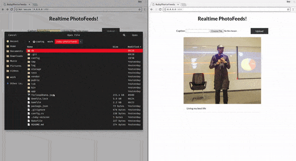

# Realtime PhotoFeeds with Pusher + Cloudinary + Ruby

[View tutorial](https://pusher.com/tutorials/photo-sharing-ruby-rails)

Getting Started
------

#### Clone The Repository
`$ git clone https://github.com/oreHGA/pusher-photofeed-ruby.git`

#### Change directory
`$ cd pusher-photofeed-ruby`

#### Install dependencies
`$ bundle install`

#### Setup up database
`$ rails db:setup`

`$ rails db:migrate`

#### Run the app
`$ rails serve`

Prerequisites
------
A basic knowledge of Ruby

Built With
------
- [Pusher](https://pusher.com) - A Ruby gem to interact with the Pusher REST API
- [Cloudinary](https://cloudinary.com/) - Cloudinary is a media management platform for web and mobile developers
